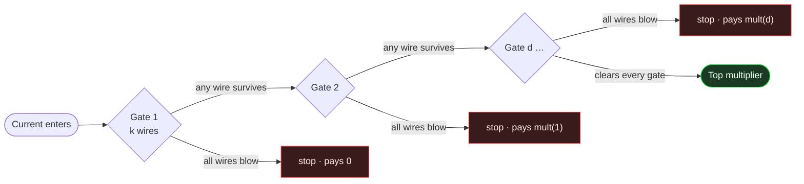
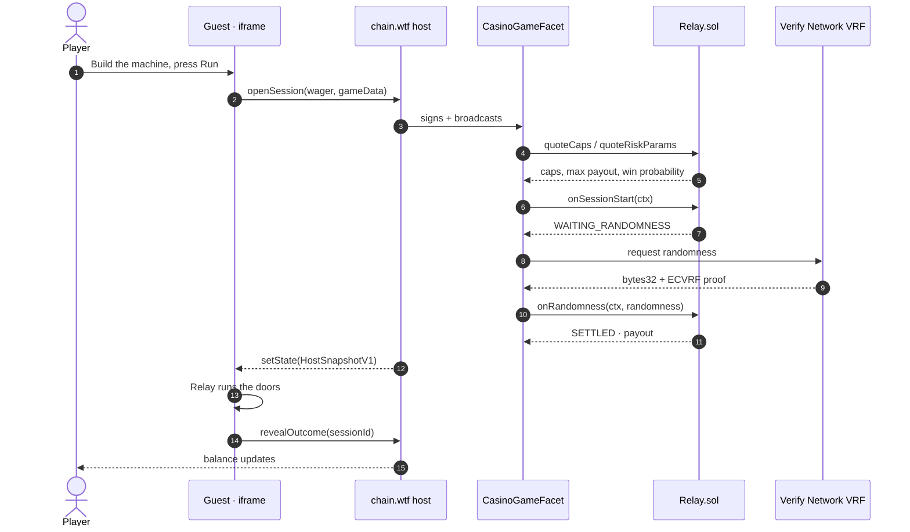
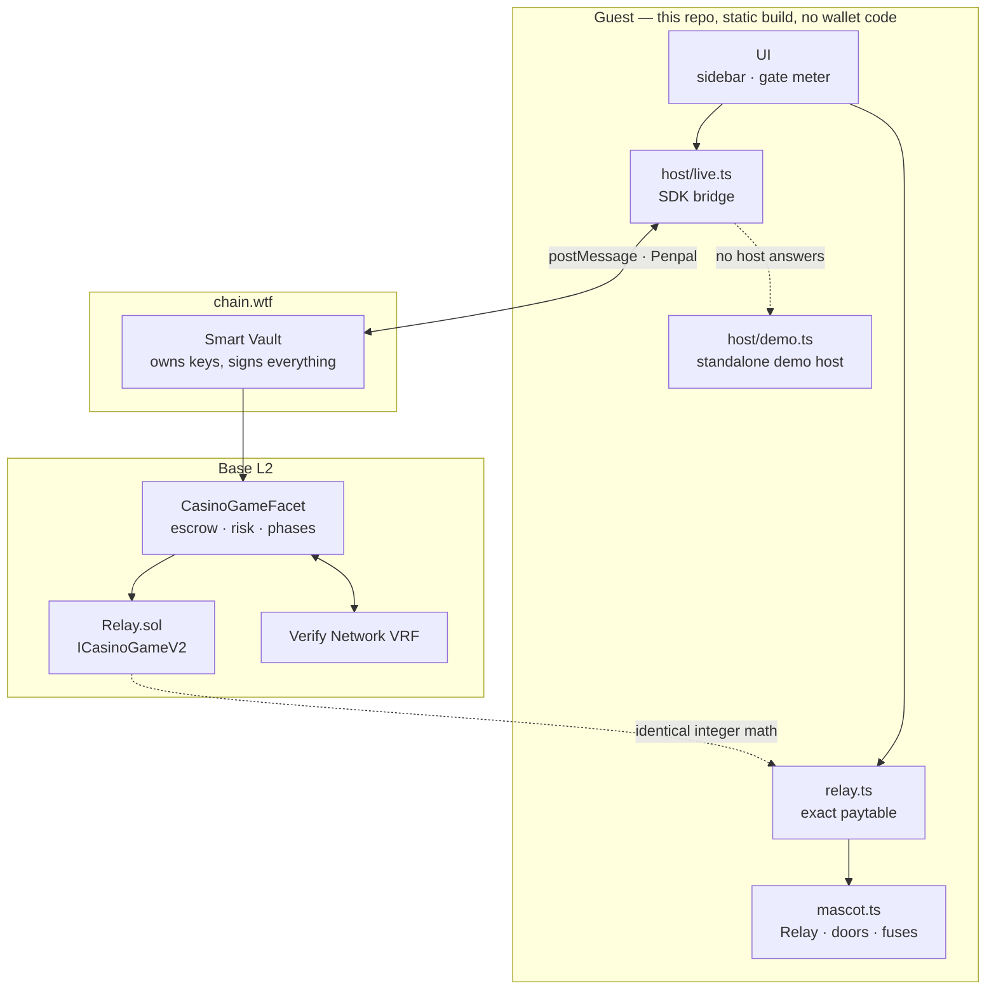

<p align="center">
  
</p>

<h1 align="center">Relay</h1>

<p align="center">
  <strong>Build the machine, then send the current through it.</strong><br />
  A Chain Jam Vol. 1 entry — an original casino game on the Chain SDK.
</p>

<p align="center">
  <a href="https://meetrelay.xyz"><strong>▶ Play at meetrelay.xyz</strong></a>
</p>

<p align="center">
  
  
  
  
</p>

---

Spend twelve wires across a row of gates. A gate opens if **any one** of its wires
survives. You are paid for how far the current gets.

There is no cash-out, no per-round decision and nothing to learn. You shape a machine
once, then run it — wide and shallow grinds out small wins, thin and deep almost always
dies at the first gate and occasionally pays 605×. **Every one of the 1,490 legal builds
returns exactly the same 96%.** You are choosing the *shape* of the risk, never the edge.

The current is a character. Relay runs the row of doors you built; each door's wires are
the fuses in the box above it, any live fuse throws the breaker and the leaves part, and
a door whose fuses all blow stays shut — so the gate that stops the run is also the
punchline. Relay is drawn entirely in code, and the round's state machine is what a Rive
or sprite version would plug into later.

## The mechanic



More wires on a gate makes it likelier to open but costs you depth elsewhere — the
budget is fixed at twelve. Spread them wide for a shallow, frequent grind; string them
out one-per-gate for twelve coin flips in a row.

| Build | Any pay | Top pay |
| --- | --- | --- |
| `[4,4,4]` — **GRIND** | 93.8% | 1.04× |
| `[4,4,1,1,1,1]` — **CLIMB** | 93.8% | 5.70× |
| `[1]×12` — **MOONSHOT** | 50.0% | 604.94× |

## How a round settles

The guest never touches a wallet. It encodes intent, the host signs, the chain decides.



The host hides winnings from its balance display until `revealOutcome` fires, so the top
bar can never spoil the result before Relay reaches the door that stops him.

## The math

A gate holding `k` wires opens with probability exactly `(2^k − 1) / 2^k`. Wires are
independent single VRF bits, so clearing the first `d` gates has probability

```
R_d = ∏(2^k_i − 1) / 2^(Σ k_i)
```

Because the wire budget is fixed at 12, every probability in the game is a rational
number over `2^12 = 4096`. Nothing is approximated and no floating point is involved
anywhere in the paytable.

The payout for stopping at depth `d` is `mult(d) = C / R_d`, with `C` chosen per build so
the expectation is exactly the declared RTP:

```
C = RTP / (1 + Σ_{i≥2} 2^(−k_i))
```

That normalisation is what makes every build worth the same. Integer division floors, so
realised RTP is always at or just below the declared 96% — never above, which would
under-reserve the house.

**Declared RTP: 96.00%**

## Architecture



`relay.ts` and `Relay.sol` are the same paytable written twice. A test compiles the
contract, deploys it to a real EVM and asserts they agree — if they ever drift, the
declared RTP stops being true.

## Repo layout

| Path | What it is |
| --- | --- |
| `contracts/Relay.sol` | `ICasinoGameV2` implementation — the canonical copy |
| `web/src/lib/relay.ts` | The same math in TypeScript, mirrored bit-for-bit |
| `web/src/host/live.ts` | Bridge to the chain.wtf host (no wallet code) |
| `web/src/host/demo.ts` | Standalone host so the URL is playable on its own |
| `web/src/game/mascot.ts` | Relay, the current as a character: doors, fuses, the beats of a round |
| `web/src/game/` | Build editor, stage contract, synthesised audio |
| `web/public/game.manifest.json` | Host manifest |
| `web/public/icon.svg` | Logo, favicon and catalog icon |
| `scripts/` | SDK setup, contract sync, compile check |

## Running it

```sh
./scripts/setup-sdk.sh     # fetch the Chain casino SDK and install it
cd web && npm install

# terminal 1 — chain + VRF node + casino + harness on :3300
cd sdk && npm start

# terminal 2 — the game on :5173
cd web && npm run dev
```

Then open `http://localhost:3300/?game=http://localhost:5173` to play it through the real
host bridge.

`http://localhost:5173` on its own boots the demo host and is fully playable — that is
what the jam gallery and the judges load. Append `?force=clear` to make every wire
survive, which is the only sane way to watch the twelve-door celebration on demand.

## Tests

```sh
cd web && npm test              # unit + differential-vs-EVM
node scripts/compile-check.mjs  # compile with the simulator's exact solc settings
```

- **RTP invariant** — all 1,490 legal builds are enumerated and asserted to return
  exactly 96%, never above.
- **Differential** — the contract is compiled, deployed to a real EVM, and its
  multipliers, `quoteRiskParams` and settled payouts are compared against the TypeScript
  paytable.
- **Empirical** — 200k simulated rounds per preset converge on the declared RTP.

With the local stack running, `npx vite-node scripts/e2e.ts 25` drives real sessions
through `LocalCasinoHost` and the bundled ECVRF node and checks every settled on-chain
payout against the same paytable.

## Deploying

Both configs are committed and both keep framing open, which matters twice — chain.wtf
loads the game in an iframe, and the jam gallery renders a live playable preview of it.
**Never add `X-Frame-Options` here.**

**Vercel** — set the project's Root Directory to `web` in Project Settings. `web/vercel.json`
then runs relative to that (`npm ci`, `npm run build`, publishes `dist`). A `vercel.json` at
the repo root is ignored once Root Directory points elsewhere; it must live inside that
directory.

**Netlify** — `netlify.toml` sets base `web`, publish `dist`.

After deploying, confirm both of these on the live URL:

```sh
curl -sI https://meetrelay.xyz/ | grep -i x-frame-options    # must print nothing
curl -s  https://meetrelay.xyz/game.manifest.json | head -3  # must be served same-origin
```

## Notes on the implementation

- Wires consume one VRF bit each. A single bit is exactly uniform over `{0,1}`, so no
  rejection sampling is needed here — that requirement applies when folding bytes onto a
  range that does not divide 256, which this game never does.
- `onRandomness` deliberately leaves `reservedProfitDelta` at zero. The host checks the
  payout against `escrowedStake + reservedProfit` *after* applying step deltas, so
  releasing reserved profit at settlement would cap every win at the stake.
- `quoteForfeitPayout` returns 0. This is an instant game with nothing cashable
  mid-round, and quoting anything else would be an adverse-selection exploit against the
  vault.
- The guest holds no wallet code and reads everything from `HostSnapshotV1`.
- The whole game is one static bundle, ~19 kB gzipped, with no runtime dependency on the
  SDK — the three bridge modules it needs are vendored into `web/src/sdk/`.
